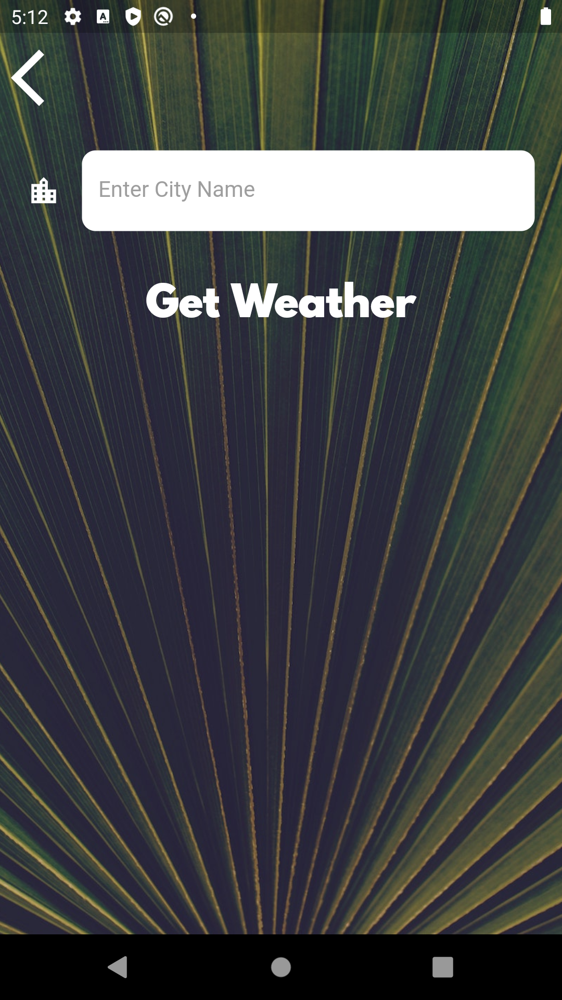

Kullanıcının anlık konumu veya girilen şehir isminin hava durumunu gösteren flutter uygulmasıdır.

Hava durumu verileri için [Open Weather Map](https://openweathermap.org/) API Servisi kullanılmıştır.

## Application Images

 
