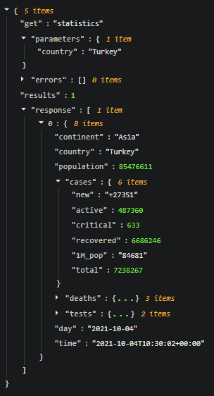
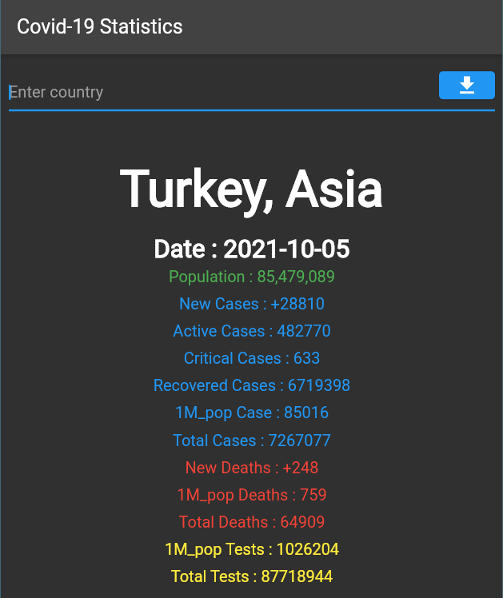

Ülkeye göre Covid-19 istatistik bilgilerini gösteren flutter uygulamasıdır.
Covid-19 bilgileri [Rapid API](https://rapidapi.com/)'dan alınmıştır.
Bu uygulama flutter içerisinde en yaygın kullanınlan [Chopper](https://pub.dev/packages/chopper), [Built Value](https://pub.dev/packages/built_value), [Built Value Serializer](https://pub.dev/packages/built_value), [Built Value Converter](https://pub.dev/packages/built_value), [Provider](https://pub.dev/packages/provider), [Build Runner](https://pub.dev/packages/build_runner) gibi kütüphanelerin kullanım örneğidir.

## Json Veri Örneği

 

## Application Images

 
