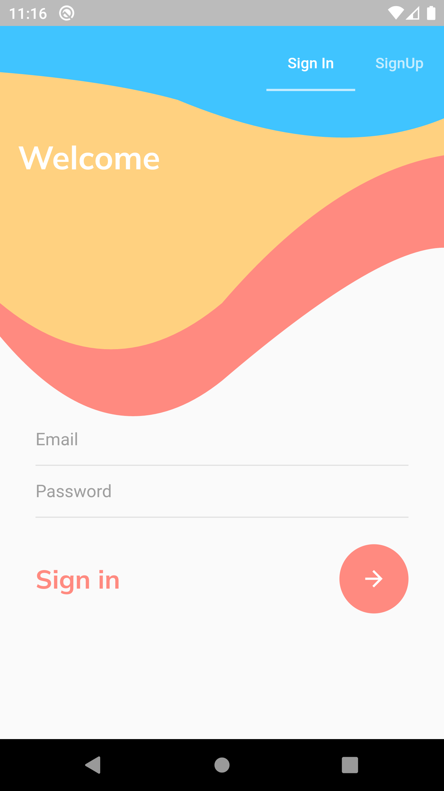
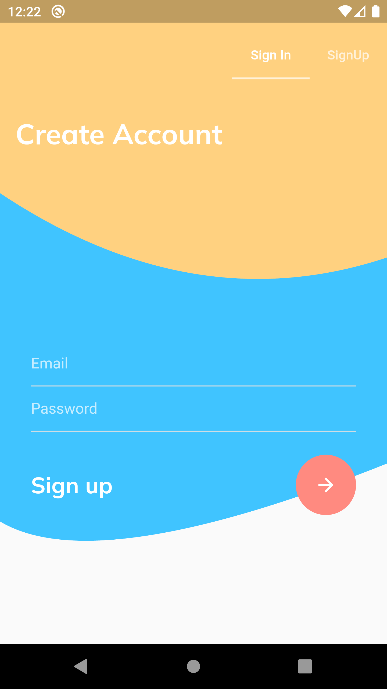
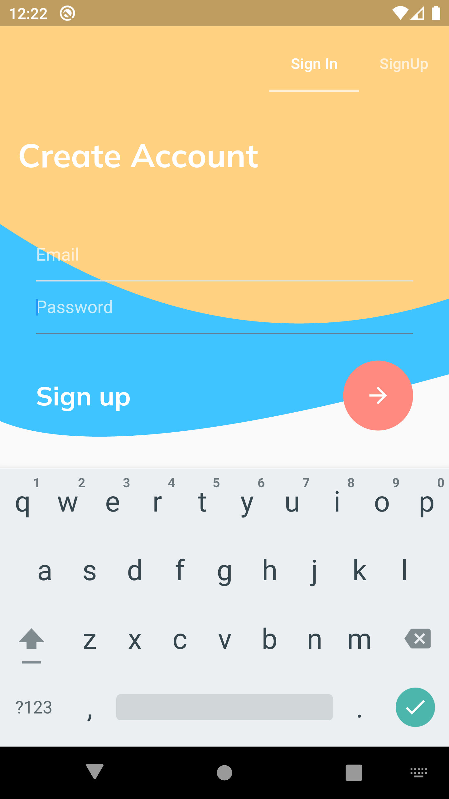
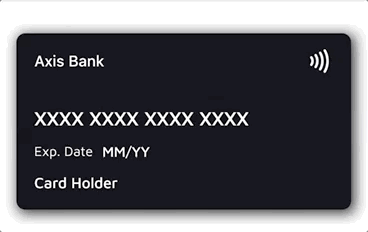
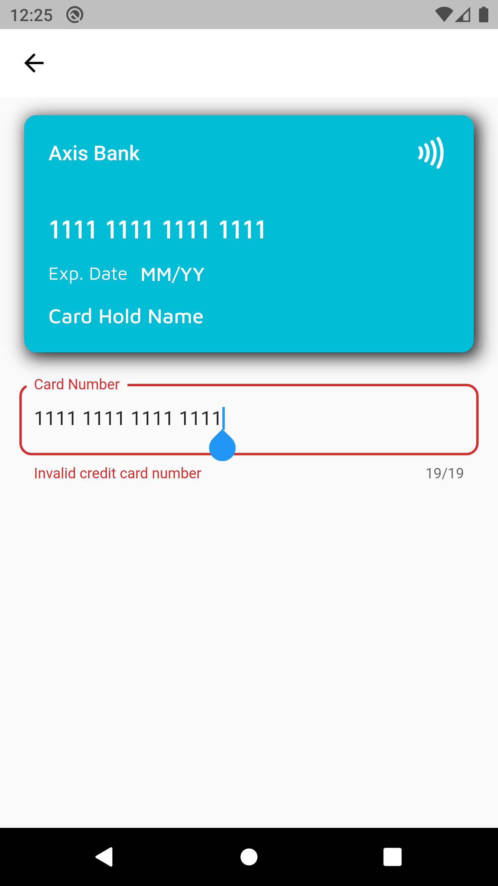
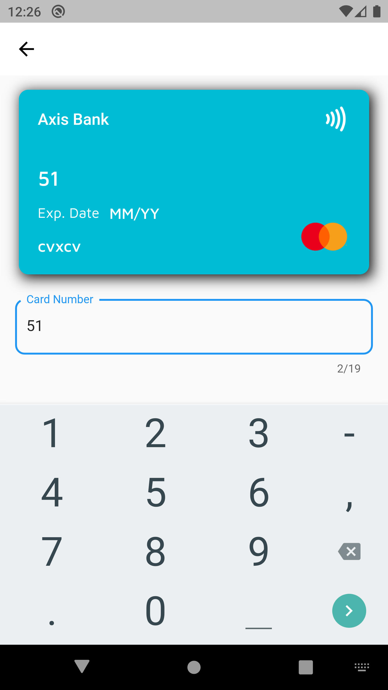
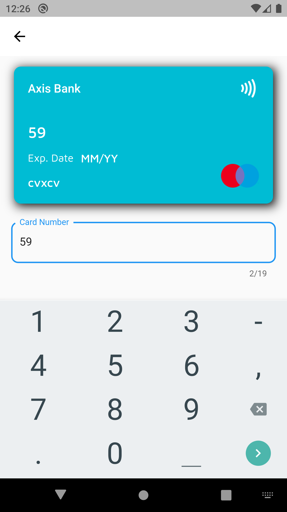
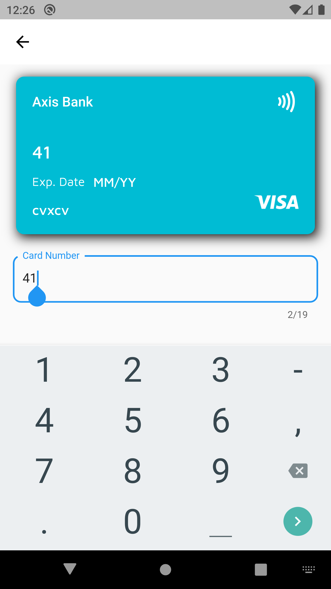

# Kütüphaneler

 * Oturum işlemleri ve veri depolama için [Firebase](https://pub.dev/packages/firebase_core),
 * Tasarım Modeli için [Bloc ve Cubit](https://pub.dev/packages/bloc) kullanılmıştır.
 
## Dinamik Arkaplan

Oturum Ekranında yer alan arkaplan ClipPath ile çizdirilmiştir. Farklı ekranlarda veya klavye açıldığında kendini günceller.

   

## Kart Animasyon

## Kart Doğrulayıcı
Kredi kartının türüne göre kredi kartı numaralarını, son kullanma tarihlerini ve güvenlik kodlarını (CVV/CVC) doğrulamak;

 

## Otomatik Kart Tespiti

  

Desteklenen Kartlar :

* Visa
* Mastercard
* American Express
* Discover
* Diners Club
* JCB
* Union Pay
* Maestro
* Mir
* Elo
* Hiper/Hipercard

