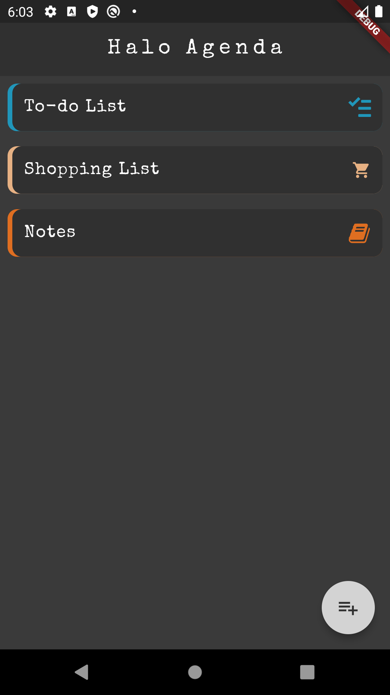
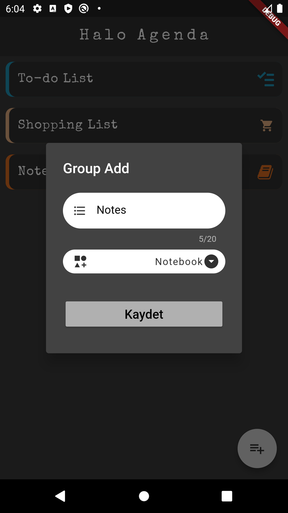
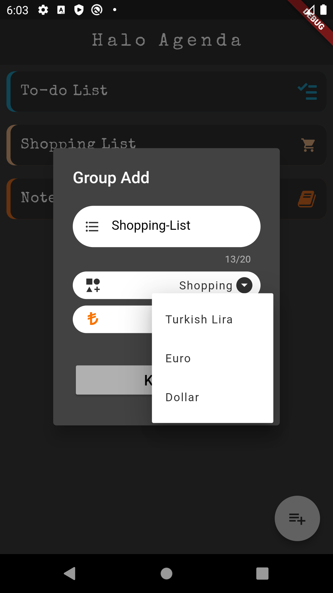
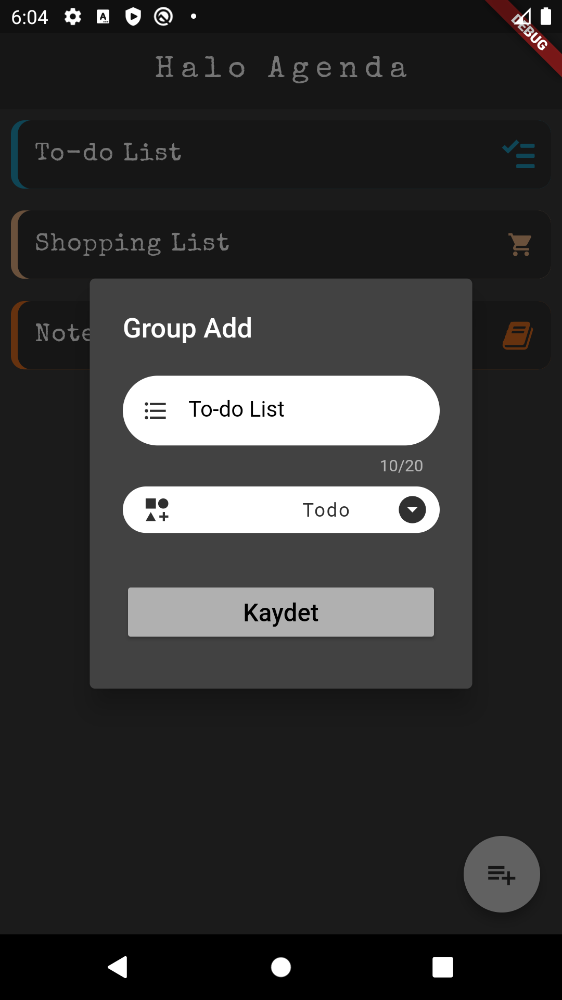
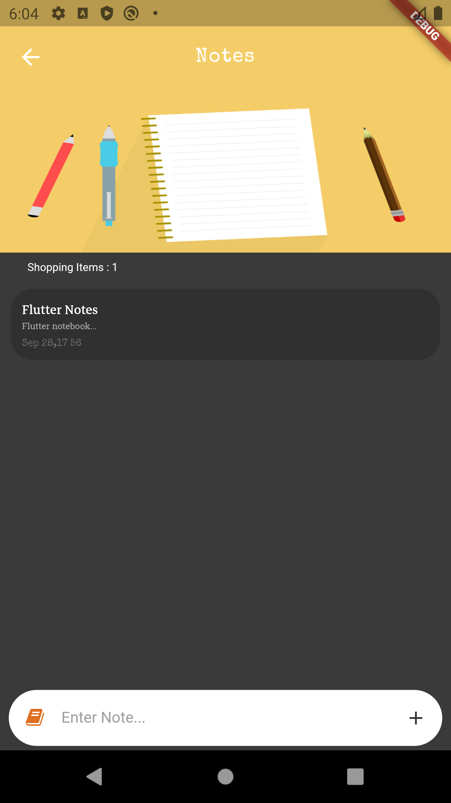
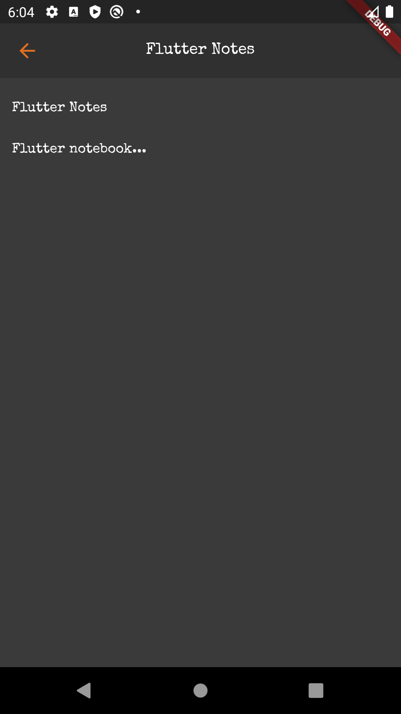
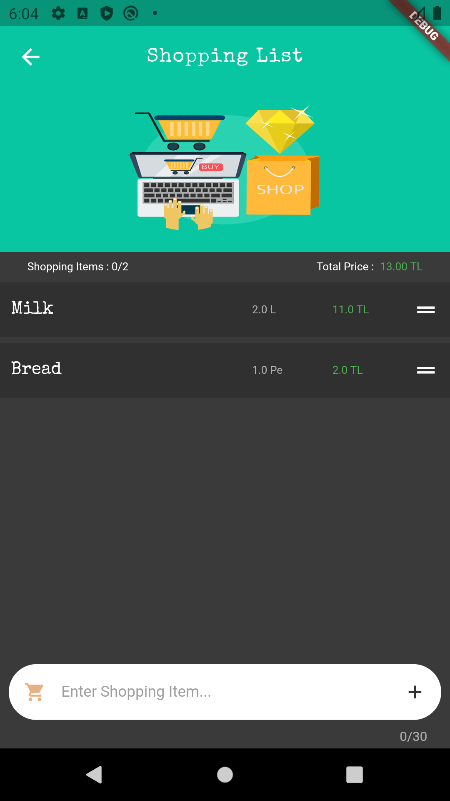
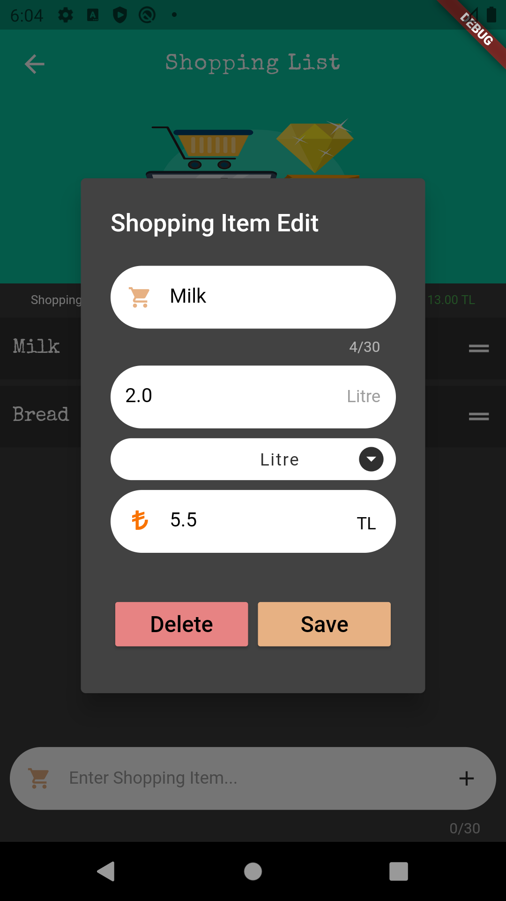
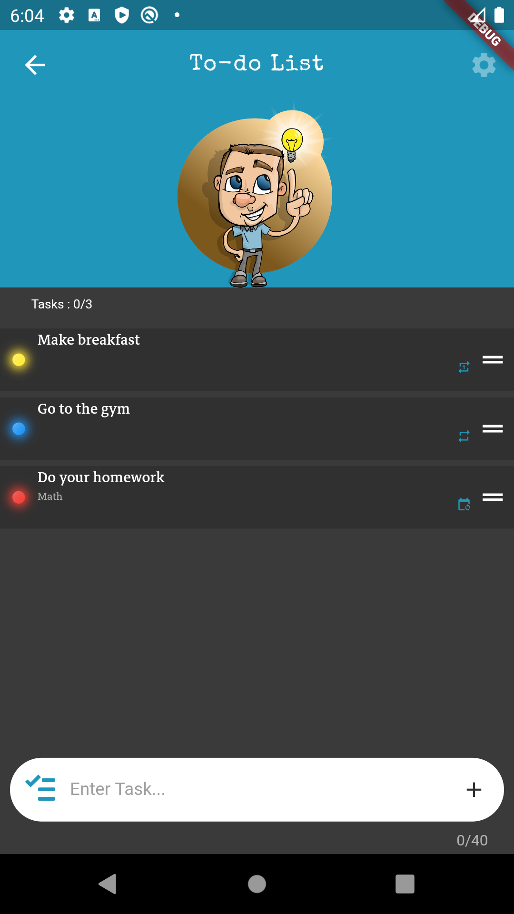
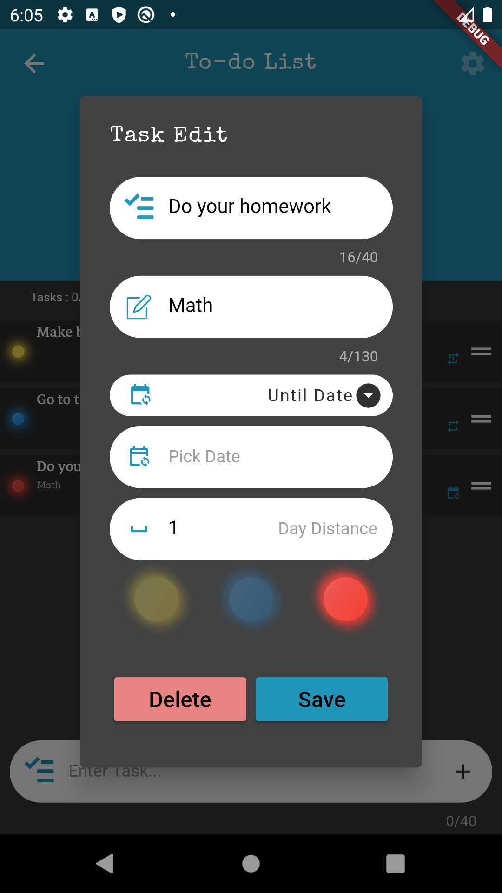

Kişisel agenda flutter uygulamasıdır. Alış-veriş listesi, To-do listesi ve not defteri olmak üzere 3 gruptan oluşmaktadır. Her grup kendi özelliklerine sahiptir. Örneğin Alış-veriş listesi para birimi mevcuttur ve otomatik fiyat hesaplaması yapmaktadır.

Veritabanı olarak [sqflite](https://pub.dev/packages/sqflite) kullanılmıştır.

## Application Images

###Home Screen

###Add Notebook Group
  
 
###Add Shopping Group
  
 
###Add Todo Group
 

###Notes Screen
 

###Shooping Screen
 

###Todo Screen
 

